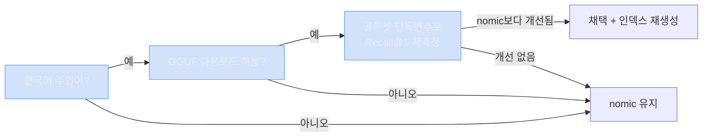
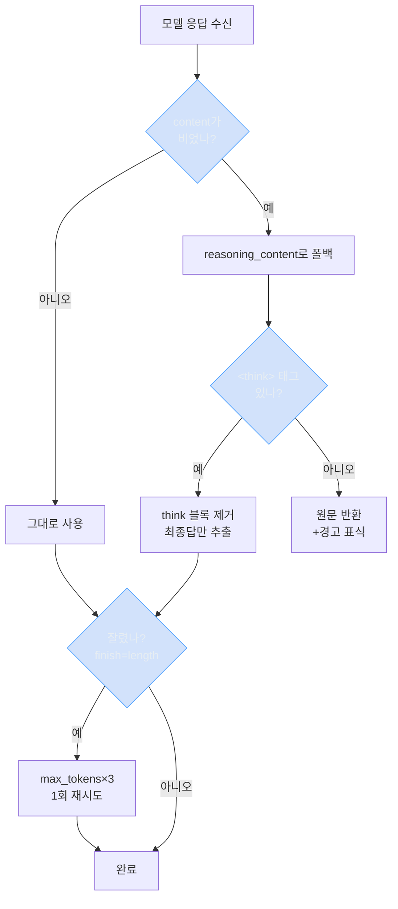
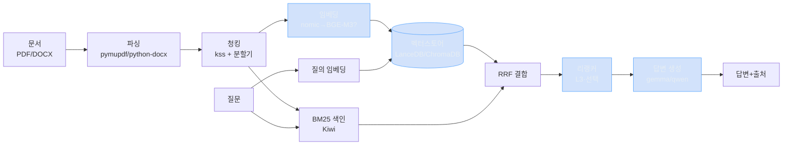

# 결정해야 할 것 — 한눈에 보기

이 문서는 흩어져 있는 **"사람이 직접 골라야 하는 항목"** 만 한 곳에 모은 것입니다. 기존 문서들은 그대로 두고, 여기서는 **무엇을·왜·어떻게 고르는지**를 쉬운 말로 다시 설명합니다.

> 정본(SSOT)은 [시작프롬프트.md] 와 [01_시스템구성/01_기술스택결정서.md](../01_시스템구성/01_기술스택결정서.md) 입니다. 숫자·근거가 충돌하면 그쪽이 우선입니다. 이 문서는 **요약·길잡이**입니다.

---

## 0. 용어 먼저 (3개만 알면 됨)

| 표시 | 뜻 | 사용자가 할 일 |
| --- | --- | --- |
| **DECISION** | 돈(다운로드)·디스크·둘 중 택1처럼 **사람이 골라야** 진행되는 것 | **고른다** |
| **[확인필요]** | 아직 "사실"이 확인 안 된 것 (지원 여부, 정확한 값 등) | **먼저 확인한다** |
| **권장 확정** | 이미 1순위로 정해져 있어 손댈 필요 없는 것 | 그냥 둔다 (참고만) |

핵심: **DECISION은 고르는 것**, **[확인필요]는 확인하는 것**. 이 둘만 신경 쓰면 됩니다.

---

## 1. 전체 결정 지도

먼저 결정들이 서로 어떻게 엮여 있는지 봅니다. **위에서 아래로** 결정해 나가면 됩니다.

```mermaid
flowchart TD
    Start([시작]) --> Q1{한국어가<br/>주 사용 언어인가?}

    Q1 -->|예| D2[BGE-M3 임베딩<br/>교체 검토 진입]
    Q1 -->|아니오| Keep[현재 nomic 유지<br/>교체 불필요]

    D2 --> Q2{GGUF 1~2GB<br/>다운로드 허용?}
    Q2 -->|예| Verify[골든셋으로<br/>Recall@1 재측정]
    Q2 -->|아니오| Keep
    Verify -->|개선 확인됨| Adopt[BGE-M3 채택<br/>인덱스 재생성]
    Verify -->|개선 없음| Keep

    Start --> Store{벡터스토어<br/>택1}
    Store -->|디스크 효율·메타필터| Lance[LanceDB]
    Store -->|최소구성·예제많음| Chroma[ChromaDB]

    Start --> Gen{기본 생성모델<br/>택1}
    Gen -->|긴 문맥 필요| Gemma[gemma-4-e4b<br/>ctx 65536]
    Gen -->|추론 품질 우선| Qwen[qwen3.5-9b<br/>ctx 8192]

    Start --> L3{L3 단계<br/>리랭커 도입?}
    L3 -->|품질 더 필요| Rerank[BGE-reranker-v2-m3<br/>+ 서빙방식 확인필요]
    L3 -->|아직 불필요| Skip[생략]

    classDef decision fill:#1f6feb33,stroke:#58a6ff,color:#e6edf3;
    classDef pick fill:#23863633,stroke:#3fb950,color:#e6edf3;
    class Q1,Q2,Store,Gen,L3 decision;
    class Lance,Chroma,Gemma,Qwen,Adopt,Keep,Rerank,Skip pick;
```

요약하면 결정은 4갈래입니다: **① 임베딩 교체 여부**, **② 벡터스토어 택1**, **③ 생성모델 택1**, **④ 리랭커 도입(L3)**. 나머지는 작은 부속 결정입니다.

---

## 2. 지금 당장 골라야 하는 것 (우선순위 순)

아래 표만 채우면 L1 개발을 시작할 수 있습니다.

| # | 결정 항목 | 선택지 | 권장 | 언제 필요 | 출처 |
| --- | --- | --- | --- | --- | --- |
| 1 | **한국어 주언어 여부** | 예 / 아니오 | (사용자 답) | 지금 | §B-9 #1 |
| 2 | **벡터스토어** | LanceDB / ChromaDB | LanceDB | L1 시작 전 | ADR-09 |
| 3 | **기본 생성모델** | gemma-4-e4b / qwen3.5-9b | gemma-4-e4b | L1 시작 전 | §B-9 #8 |
| 4 | **BM25 엔진** | rank_bm25 / 기타 | rank_bm25 | L2 | ADR-08 |
| 5 | **reasoning 대응 방식** | 코드 폴백 / 프리셋 수정 | 코드 폴백(필수) | L1 | §B-9 #10 |
| 6 | **BGE-M3 다운로드** | 예 / 아니오 | (측정 후 결정) | L2 | ADR-07 |
| 7 | **리랭커 도입·서빙** | 도입 / 생략 + 서빙방식 | L3에서 결정 | L3 | ADR-11 |
| 8 | **인덱스 헤더 저장 위치** | 사이드카 / 스토어내장 | 사이드카 파일 | L1 | DB §1-2 |
| 9 | **백업 보관 정책** | 개수·경로 | 권장 기본값 | 운영 | 런북 §4 |

---

## 3. 각 결정 자세히 (쉬운 설명)

### 결정 ① 임베딩 모델을 BGE-M3로 바꿀까?

**무슨 문제냐면**: 지금 쓰는 임베딩 모델(`nomic`)이 한국어에 약합니다. 실제로 "연차 휴가 신청 절차"를 검색하면 **정답이 1등이 아니라 3등**으로 나옵니다(Recall@1 = 0, 정답이 오답보다 0.018 낮음). 이건 추측이 아니라 **직접 측정된 사실**입니다.

**대안 후보**: BGE-M3 (한국어 더 잘함, 1024차원, MIT 라이선스, 다운로드 1~2GB)

| 비교 | 현재 nomic | BGE-M3 (후보) |
| --- | --- | --- |
| 차원 | 768 | 1024 |
| 정규화(norm) | 1.0 보장 (재정규화 금지) | **보장 안 됨 → 재측정 필요** |
| 한국어 | 약함 (실측) | 우수 (외부 사양, **우리 측정 아님**) |
| 컨텍스트 | — | 8192 |
| 비용 | 0 (이미 서빙 중) | GGUF 1~2GB 다운로드 |

**고르는 기준 (순서대로)**:



> **함정 주의**: "BGE-M3가 한국어 잘한다"는 **남의 사양**입니다. 우리 데이터로 직접 재보기 전엔 채택하면 안 됩니다(원칙 D2). 그리고 차원이 768→1024로 바뀌면 **기존 인덱스를 전부 다시 만들어야** 합니다.

---

### 결정 ② 벡터스토어: LanceDB vs ChromaDB

**무슨 선택이냐면**: 임베딩 벡터를 저장하고 검색할 데이터베이스를 하나 고릅니다. 둘 다 **서버 없이 파일로 동작**(임베디드)하고 완전 로컬이라 어느 쪽이든 제약은 만족합니다.

| 비교 | LanceDB (권장) | ChromaDB |
| --- | --- | --- |
| 강점 | 디스크 효율, 컬럼형 메타필터, 빠른 성장 | API 단순, RAG 예제 풍부 |
| 약점 | 생태계 비교적 신생 | 대규모 성능 [확인필요] |
| 이런 경우 선택 | 디스크 효율·메타필터 중시 | 최소 구성·예제 친화 |

**권장**: 잘 모르겠으면 **LanceDB**. 어느 쪽을 고르든 코드는 얇은 `VectorStore` 인터페이스 뒤에 숨겨서 나중에 바꾸기 쉽게 만듭니다.

---

### 결정 ③ 기본 생성모델: gemma vs qwen

**무슨 선택이냐면**: 답변을 생성할 LLM을 고릅니다. 둘 다 LMStudio에 이미 있습니다.

| 비교 | gemma-4-e4b (권장) | qwen3.5-9b |
| --- | --- | --- |
| 컨텍스트 | **65536** (매우 김) | 8192 |
| 강점 | 긴 문맥 → 청크 많이 넣기 가능 | 추론 품질 |
| 주의 | 4B급이라 품질 한계 가능 [추정] | 문맥 짧아 청크 수 제한 |

**권장**: **gemma-4-e4b** (긴 컨텍스트가 RAG에 유리). 단, **세 모델 모두 reasoning 이슈**(아래 ⑤)가 있으니 폴백 처리부터 검증한 뒤 품질을 재평가합니다.

---

### 결정 ④ reasoning 대응 방식 (사실상 필수)

**무슨 문제냐면**: 생성 모델 3종이 전부 **답을 엉뚱한 곳에 담아 보냅니다**. 정상 자리(`content`)는 비어 있고, 실제 답이 `reasoning_content`(사고 과정 칸)에 들어옵니다. 게다가 사고가 안 끝나서 "한 문장" 질문에 **12,972자**를 토해내고 잘립니다.



**무효 확인된 우회책 (쓰지 말 것)**: `/no_think`, `enable_thinking=false`, `reasoning_effort=low`, `max_tokens=4000` — **전부 효과 없음**(실측).

**선택지**:
- **A. 코드 폴백** (권장·필수): 위 흐름을 `chat()` 래퍼 한 곳에 구현. 모델이 어떻든 동작.
- **B. LMStudio 프리셋 수정**: reasoning 종료 토큰 설정. 근본 해결이지만 **메뉴 위치가 버전마다 달라 [확인필요]**. B가 되더라도 A는 안전망으로 둡니다.

---

### 결정 ⑤ 리랭커 도입 (L3 단계)

**무슨 선택이냐면**: 1차 검색 결과를 더 정밀한 모델(cross-encoder)로 한 번 더 재정렬해 정확도를 올립니다. **L3(후반) 단계** 항목이라 지금 당장은 아닙니다.

| 항목 | 내용 |
| --- | --- |
| 후보 | BGE-reranker-v2-m3 (권장) |
| 비용 | 모델 다운로드 (**DECISION**) |
| 서빙 방식 | **[확인필요]** — LMStudio가 리랭커 엔드포인트를 줄지 불확실 |
| 대안 서빙 | `sentence-transformers`/`FlagEmbedding` 별도 로컬 프로세스 |

> L3 진입 **전에** 서빙 방식부터 검증해야 합니다. 안 되면 L3 핵심 산출물이 막힙니다.

---

## 4. [확인필요] 목록 — 결정 전에 사실부터 확인할 것

이건 "고르는 것"이 아니라 **"확인하는 것"** 입니다. 대부분 BGE-M3로 바꿀 때 한 번에 확인하면 됩니다.

| 확인할 것 | 왜 | 확인 방법 |
| --- | --- | --- |
| BGE-M3의 `normalized`(norm=1.0?) | 정규화 안 되면 유사도 왜곡 | 임베딩 1건 뽑아 L2 norm 측정 |
| BGE-M3의 `metric`(cosine=dot?) | norm 결과에 종속 | norm 측정 후 판단 |
| BGE-M3 prefix 요구사항 | e5 계열은 prefix 필수 | 모델 카드 확인 |
| 리랭커 서빙 호환 | LMStudio 지원 불확실 | L3 전 검증 |
| Windows 동작 | 절차가 macOS 기준 | 해당 OS에서 테스트 |
| 네이티브 휠 설치(lancedb/kiwipiepy) | 빌드 실패 가능 | 설치 시점 확인 |
| Kiwi 버전 | BM25 인덱스 무효화 키 | 설치 버전 기록 |

---

## 5. 부속 결정 (작은 것들)

| 항목 | 선택 | 권장 |
| --- | --- | --- |
| 인덱스 헤더 저장 위치 | 사이드카 `_index_header.json` / 스토어 내장 | **사이드카**(스토어 종속 회피). 둘 다 있으면 사이드카가 정본 |
| 백업 보관 개수·경로 | 운영 정책 | 런북 권장 기본값 |
| 원문(`data/`) 백업 포함 여부 | 포함 / 제외 | 외부 원본 있으면 제외 가능 |

---

## 6. 이미 정해진 것 (참고만 — 손댈 필요 없음)

아래는 **DECISION이 아니라 권장 확정**입니다. 고민하지 말고 그대로 쓰면 됩니다.

| 계층 | 정해진 선택 |
| --- | --- |
| 언어 | Python 3.11+ |
| 추론 SDK | `openai` SDK (`base_url`만 localhost로) |
| 토큰/길이 계산 | 문자 수 1차 + HF 토크나이저 (`usage` 신뢰 금지) |
| 문서 파싱 | `pymupdf`(PDF) + `python-docx`(DOCX) |
| 청킹 분할기 | `langchain-text-splitters` (분할기 부품만) |
| 문장 분리 | `kss` |
| 형태소/BM25 토큰 | `Kiwi` (kiwipiepy) |
| 하이브리드 결합 | RRF (k=60) |
| 오케스트레이션 | 자체 얇은 파이프라인 (프레임워크 본체 안 씀) |

전체 파이프라인은 이렇게 흐릅니다:


파란색 박스가 **결정이 필요한 지점**입니다.

---

> 더 깊은 근거가 필요하면: 스택 결정 전체는 [01_기술스택결정서](../01_시스템구성/01_기술스택결정서.md), 인덱스 헤더는 [01_인덱스_메타데이터_설계](../03_DATABASE/01_인덱스_메타데이터_설계.md), 로드맵은 [02_범위_마일스톤](../02_기획서/02_범위_마일스톤.md), 교체 절차는 [01_운영_런북](../05_운영_평가/01_운영_런북.md)을 보세요.
