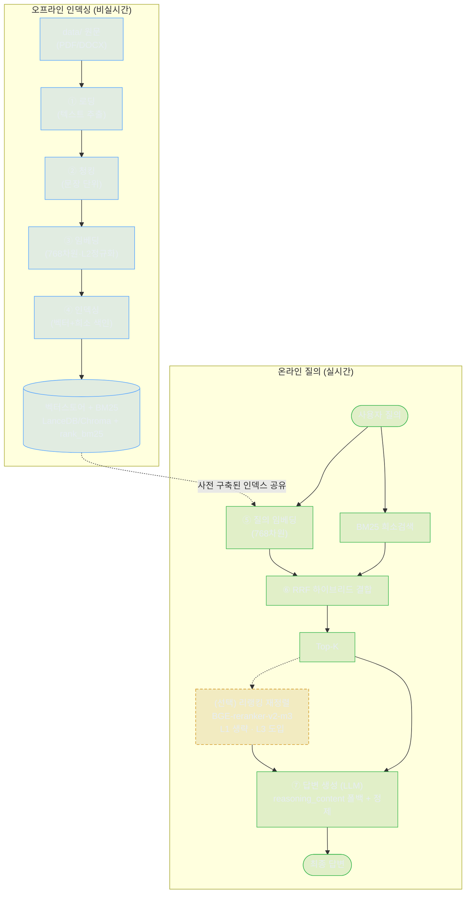
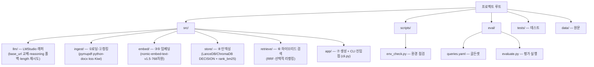

# 시스템 아키텍처

docs-em RAG 시스템의 전체 구조를 오프라인 인덱싱과 온라인 질의 두 파이프라인으로 분리하고, 7단계 데이터흐름과 공통 인프라를 정의합니다.

> 관련: [시작프롬프트 §B-1](../../시작프롬프트.md) · [02_내부API.md](./02_내부API_인터페이스.md) · [99_불변식.md](../99_AI참조/01_실측제약_불변식.md)

---

## 1. 설계 원칙

본 시스템은 **로컬 전용** RAG 파이프라인입니다. 모든 추론(임베딩·생성)은 로컬 LMStudio(`http://localhost:1234/v1`, OpenAI 호환)에서 수행하며 외부 클라우드 API(OpenAI/Anthropic/Cohere)는 절대 사용하지 않습니다. 1순위 목표는 **한국어 문서 검색 품질**입니다.

핵심 분리 원칙은 다음과 같습니다.

| 원칙 | 내용 |
| --- | --- |
| 오프라인/온라인 분리 | 인덱스 생성(비실시간)과 질의 응답(실시간)을 독립 파이프라인으로 분리 |
| 얇은 파이프라인 | 프레임워크 의존 최소화, 각 단계를 교체 가능한 컴포넌트로 구성 |
| 정량 검증 | 모든 개선은 골든셋 기반 정량지표(Recall@k/MRR/nDCG)로 증명 (→ [시작프롬프트 §B-8-3](../../시작프롬프트.md), 단일변수 평가) |
| 단계적 도입 | L1 검색 MVP → L2 임베딩교체·하이브리드 → L3 리랭킹·서빙·자동화 (→ [시작프롬프트 §B-10](../../시작프롬프트.md), 로드맵) |

---

## 2. 전체 구조 — 두 파이프라인

점선 박스(리랭킹)는 **선택 단계**입니다. L1에서는 생략하고(Top-K → 생성 직결), L3에서 도입합니다. RRF 하이브리드는 벡터 검색(밀집)과 BM25(희소)의 순위를 결합합니다.

---

## 3. 7단계 데이터흐름 — 각 단계 책임

| 단계 | 이름 | 파이프라인 | 책임 | 모듈 | 핵심 사실 |
| --- | --- | --- | --- | --- | --- |
| ① | 로딩 | 오프라인 | PDF/DOCX 원문에서 텍스트 추출 | `src/ingest` | pymupdf + python-docx |
| ② | 청킹 | 오프라인 | 문장 분리 후 청크 단위 구성 | `src/ingest` | kss(문장분리) + Kiwi(형태소) |
| ③ | 임베딩 | 오프라인 | 청크를 768차원 벡터로 변환 | `src/embed` | nomic-embed-text-v1.5, L2 정규화 출력(재정규화 금지) |
| ④ | 인덱싱 | 오프라인 | 벡터 색인 + BM25 희소 색인 구축 | `src/store` | LanceDB 또는 ChromaDB **DECISION** + rank_bm25 |
| ⑤ | 질의 임베딩 | 온라인 | 질의를 동일 임베딩 공간으로 변환 | `src/embed` | ③과 동일 모델·차원 사용 |
| ⑥ | 하이브리드 검색 | 온라인 | 밀집+희소 순위 RRF 결합 → Top-K | `src/retrieve` | RRF 결합, (선택) 리랭킹 재정렬 |
| ⑦ | 생성 | 온라인 | 검색 컨텍스트로 LLM 답변 생성 | `src/app` | reasoning_content 폴백 + length 재시도 |

각 단계의 입출력 계약(함수 시그니처)은 → [02_내부API.md](./02_내부API_인터페이스.md)를 참조하십시오.

### 3.1 임베딩(③·⑤) 주의

임베딩 모델 `text-embedding-nomic-embed-text-v1.5`는 출력이 **이미 L2 정규화**되어 있습니다(norm=1.0). 재정규화는 금지하며 `abs(norm-1.0)<1e-3` 가드로 검증합니다. prefix(`search_document`/`query`) 효과는 미미합니다(0.687→0.695). `usage.prompt_tokens=0`은 오보고이므로 토큰 계측에 사용하지 않습니다. 상세는 → [시작프롬프트 §A-2①·§B-12](../../시작프롬프트.md)를 참조하십시오.

한국어 약점이 실측되었습니다. '연차 휴가 신청 절차' 질의에서 정답(휴가규정)이 3위, 오답(출장경비)보다 격차 -0.018로 **Recall@1=0**입니다. 임베딩 교체(BGE-M3, 1024차원) 또는 리랭커 도입으로 목표 **Recall@1=1**(회귀: 0→1)을 달성합니다. 교체 시 768→1024 인덱스 재생성과 norm 재측정이 필수입니다.

### 3.2 생성(⑦) 주의 — BLOCKING

생성모델 3종은 모두 로컬에서 `parallel=4`로 서빙합니다.

| 모델 | 파라미터 | ctx | 비고 |
| --- | --- | --- | --- |
| `qwen/qwen3.6-35b-a3b` | 35B MoE(실측) | 8192 | A3B 활성 |
| `qwen/qwen3.5-9b` | 9B급 [추정] | 8192 | |
| `google/gemma-4-e4b` | 4B급 [추정] | 65536 | 장컨텍스트 |

> ctx 수치와 35B MoE는 실측, 파라미터 수만 [추정]입니다.

세 모델 모두 `message.content`가 빈 문자열이고 실제 답이 `message.reasoning_content`로 옵니다. `/no_think`·`enable_thinking=false`·`reasoning_effort=low`·`max_tokens=4000`은 전부 무효이며, 무한 사고로 `finish_reason=length` 잘림이 발생합니다(한 문장 질문에 12,972자). 따라서 다음 폴백이 **필수**입니다.

1. `content`가 빈 값이면 `reasoning_content`로 폴백
2. `<think>` 태그 정제
3. `finish_reason=length`이면 `max_tokens * 3`으로 **1회 재시도**(2회째도 length면 경고 부착)

근본 대응은 LMStudio 프리셋의 reasoning 종료토큰 점검입니다([확인필요] 메뉴 위치). 생성모델 상세는 → [시작프롬프트 §B-3·§B-4](../../시작프롬프트.md)를 참조하십시오.

---

## 4. 공통 인프라

세 가지 횡단 인프라가 모든 단계에서 공유됩니다.

| 인프라 | 책임 | 위치 |
| --- | --- | --- |
| config | 모델명·엔드포인트·차원·청크 파라미터 등 중앙 설정 | 프로젝트 설정 모듈 |
| LMStudio 래퍼 | OpenAI SDK `base_url` 교체, 임베딩/생성 호출 단일화, reasoning_content 폴백·length 재시도 캡슐화 | `src/llm` |
| 평가 하네스 | 골든셋 로드, Recall@k(1/3/5/10)/MRR/nDCG 측정, 단일변수 변경 비교 | `eval/` |

### 4.1 LMStudio 래퍼

`src/llm`은 `openai` SDK의 `base_url`을 `http://localhost:1234/v1`로 교체하고 `api_key`는 더미 `'lm-studio'`를 사용합니다. 임베딩 호출과 생성 호출을 단일 진입점으로 묶고, §3.2의 reasoning_content 폴백 및 length 재시도 로직을 이 래퍼 내부에 캡슐화하여 상위 파이프라인이 해당 INV(불변식)에 직접 노출되지 않도록 합니다.

### 4.2 평가 하네스

`eval/{queries.yaml, evaluate.py}`로 구성합니다. 골든셋에는 연차휴가 회귀 케이스(Recall@1 0→1)가 포함되며, 변수를 1개씩만 변경하여 효과를 측정합니다(→ [시작프롬프트 §B-8-3](../../시작프롬프트.md)). 진입점은 `app/cli.py`입니다.

---

## 5. 컴포넌트 구성

스택은 미확정·권장 상태이며 벡터스토어(LanceDB/ChromaDB)와 BGE-M3 다운로드는 **DECISION**, 리랭커 로컬 서빙 방식은 [확인필요]입니다. 스택 상세는 → [시작프롬프트 §B-6·§B-9](../../시작프롬프트.md)를 참조하십시오.

---

## 6. 단계별 도입 매핑 (로드맵)

| 레벨 | 범위 | 본 아키텍처 적용 |
| --- | --- | --- |
| L1 | 검색 MVP + 평가 하네스 | ①~⑥(리랭킹 **생략**) + ⑦ 기본 생성, 평가 하네스 |
| L2 | 임베딩 교체 + 하이브리드 + reasoning 폴백 게이트 | ③ BGE-M3 교체(768→1024 재인덱싱), ⑥ RRF 완성, ⑦ 폴백 게이트화 |
| L3 | 리랭킹 · 서빙 · 자동화 | ⑥ 리랭킹(BGE-reranker-v2-m3) **도입**, 서빙·자동화 |

로드맵 상세는 → [시작프롬프트 §B-10](../../시작프롬프트.md)을 참조하십시오. 본 문서가 정의하는 컴포넌트 경계·INV 대응은 형제 문서 [02_내부API.md](./02_내부API_인터페이스.md)(입출력 계약)와 [99_불변식.md](../99_AI참조/01_실측제약_불변식.md)(불변식 목록)와 함께 유지되어야 합니다.
