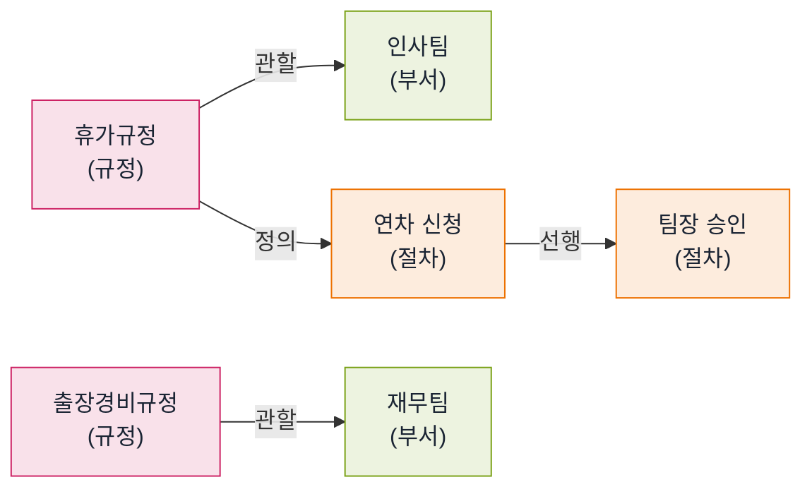
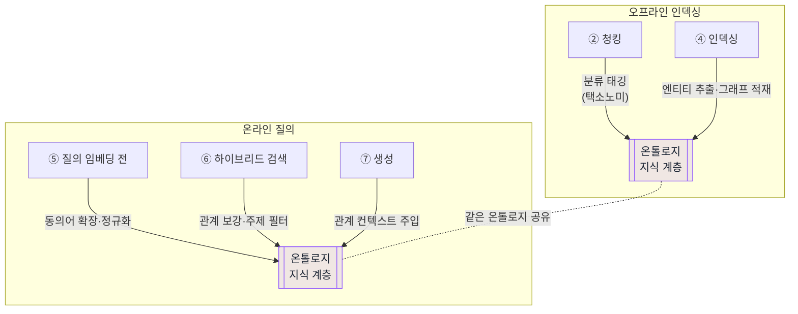
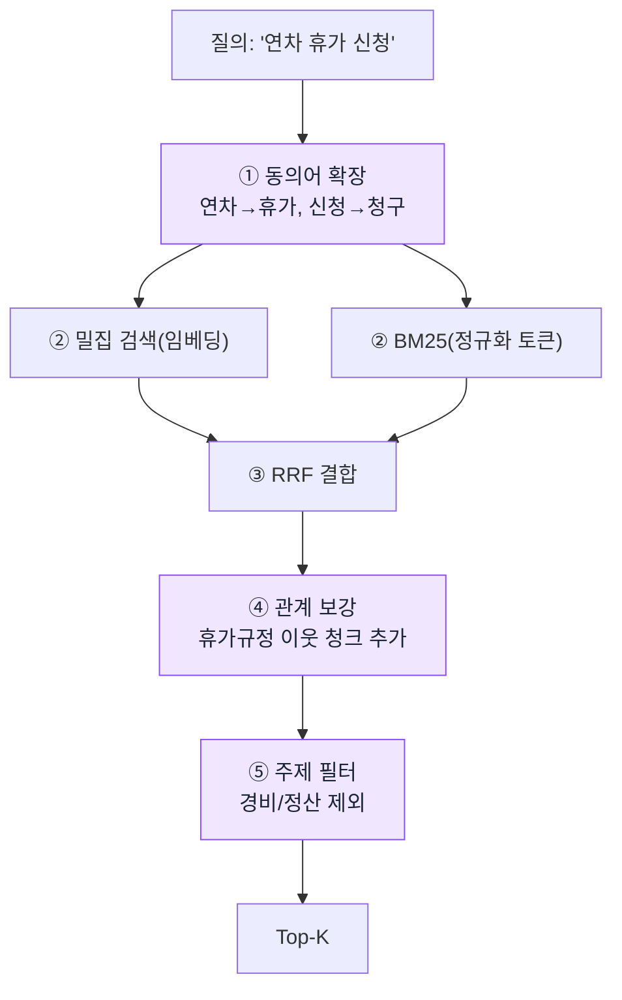

# 온톨로지 설계 (지식 계층)

docs-em에 **온톨로지(지식 계층)**를 도입해, 임베딩만으로는 메우기 어려운 한국어 검색 약점을 **개념·관계·동의어**로 보완합니다. 본 문서는 온톨로지가 무엇을·왜·어디서 쓰이는지와 7단계 파이프라인 접점, 모듈·데이터 계약, 도입 게이트를 정의합니다.

> 관련: [00_시스템아키텍처.md](./00_시스템아키텍처.md) · [01_모듈설계.md](./01_모듈설계.md) · [02_내부API_인터페이스.md](./02_내부API_인터페이스.md) · 정본 SSOT [시작프롬프트.md](../../시작프롬프트.md)

> ⚠ **신규 도입 항목**: 온톨로지는 기존 SSOT에 없던 **새 개념**입니다. 기존 불변식(INV-1~8)과 충돌하지 않으며, 임베딩·하이브리드 검색을 **대체하지 않고 보강**합니다. 모든 도입은 골든셋 단독변수 측정(INV-7)을 통과해야 채택합니다.

---

## 0. 한 줄 정의

> **온톨로지** = "우리 회사 문서 세계에 어떤 **개념(엔티티)**이 있고, 그 개념들이 서로 **어떤 관계**이며, 같은 개념을 가리키는 **다른 말(동의어)**이 무엇인지"를 사람이 정의해 둔 **지식 지도**입니다.

임베딩이 "글의 의미를 숫자로 추론"하는 **통계적·암묵적** 방식이라면, 온톨로지는 "사람이 직접 정의한 **명시적** 규칙·관계"입니다. docs-em은 둘을 **함께** 씁니다.

---

## 1. 왜 필요한가 (문제 → 온톨로지의 보완)

대표 회귀 케이스: 질의 **"연차 휴가 신청 절차"** → 정답(휴가규정) 3위, Recall@1=0. 원인 분석:

| 임베딩만 썼을 때의 한계 | 온톨로지가 메우는 방식 |
| --- | --- |
| "연차"와 "연가"·"휴가"를 다른 단어로 취급 (한국어 동의어 약점) | **동의어 사전**으로 같은 개념(`휴가`)으로 정규화 |
| "신청 절차"가 어느 부서·규정에 속하는지 모름 | **엔티티 관계 그래프**로 `휴가규정 --관할--> 인사팀` 연결 |
| 문서가 어떤 주제군인지 구분 못 함 (출장경비와 휴가 혼동) | **분류 체계(택소노미)**로 `근태/복무` vs `경비/정산` 분리 메타필터 |

> 핵심: 온톨로지는 **임베딩의 한국어 동의어·관계 약점**을 사람이 정의한 지식으로 직접 보완합니다. "BGE-M3 교체(통계적 개선)"와 **상호 보완**이며 양자택일이 아닙니다.

---

## 2. 온톨로지의 3대 구성요소

본 프로젝트가 채택하는 온톨로지는 세 부분으로 구성됩니다.

### 2.1 동의어·용어 사전 (Synonym / Lexicon)

같은 개념을 가리키는 표현을 한 묶음으로 정규화합니다.

```yaml
# ontology/synonyms.yaml (예시)
휴가:    [연차, 연가, 휴가, 월차, 반차, 유급휴가]
출장:    [출장, 외근, 파견]
경비:    [경비, 비용, 정산, 지출]
신청:    [신청, 청구, 제출, 등록]
```

- **인덱싱 시**: BM25 토큰화 단계에서 표제어로 정규화(Kiwi 형태소 + 사전).
- **질의 시**: 질문을 표제어로 확장해 검색(질의 확장, query expansion).

### 2.2 엔티티·관계 그래프 (Entity / Relation, GraphRAG)

문서에서 추출한 핵심 개념(부서·규정·절차·문서)을 노드로, 관계를 엣지로 갖는 그래프입니다.



- **검색 시**: 1차 검색으로 찾은 청크가 속한 엔티티의 **이웃 노드**를 따라가 관련 청크를 보강(relation-aware retrieval).
- **생성 시**: 답변에 "관할 부서·선행 절차" 같은 **관계 정보**를 함께 제공.

### 2.3 분류 체계 (Taxonomy)

문서를 주제 계층으로 분류해 메타필터로 활용합니다.

```
인사
 ├─ 근태/복무   → 휴가규정, 근무시간규정
 └─ 채용
재무
 ├─ 경비/정산   → 출장경비규정
 └─ 예산
```

- **인덱싱 시**: 각 청크에 `taxonomy` 메타 부착(`인사/근태`).
- **검색 시**: 질의 주제를 추정해 **범위 좁히기**(출장경비를 휴가 질의에서 배제).

---

## 3. 7단계 파이프라인 접점

기존 7단계(→ [00_시스템아키텍처.md](./00_시스템아키텍처.md))에 온톨로지가 끼어드는 지점입니다. **단계를 새로 만들지 않고 기존 단계를 보강**합니다.



| 단계 | 온톨로지 작용 | 구성요소 |
| --- | --- | --- |
| ② 청킹 | 청크에 분류 메타 태깅 | 택소노미 |
| ④ 인덱싱 | 엔티티 추출 → 관계 그래프 적재 | 엔티티·관계 |
| ⑤ 질의 임베딩 **전** | 동의어 확장·표제어 정규화 | 동의어 사전 |
| ⑥ 하이브리드 검색 | 관계 이웃 보강 + 주제 메타필터 | 엔티티·관계 + 택소노미 |
| ⑦ 생성 | 관계 정보를 답변 컨텍스트로 주입 | 엔티티·관계 |

---

## 4. 모듈 설계 — `src/ontology`

기존 6개 모듈에 **`src/ontology`(신규)**를 추가합니다. 단일책임·단방향 의존 원칙(→ [01_모듈설계.md](./01_모듈설계.md))을 그대로 따릅니다.

| 항목 | 내용 |
| --- | --- |
| 책임 | 동의어 정규화(`normalize`)·질의 확장(`expand`)·엔티티 그래프 조회(`neighbors`)·분류 추정(`classify`) |
| 입력 | (확장) 질의 문자열 / (그래프) 엔티티 ID·hop 수 / (분류) 청크 또는 질의 |
| 출력 | 정규화 표제어 리스트 / 이웃 엔티티·청크 / 택소노미 경로 |
| 의존 | 사전·그래프 데이터 파일(`ontology/`). 상위 모듈 의존 없음(하위 어댑터). |
| 사용처 | `ingest`(태깅)·`retrieve`(확장·보강)·`app`(관계 컨텍스트) |

```
ontology/
  synonyms.yaml      # 동의어·표제어 사전
  taxonomy.yaml      # 분류 체계
  entities.json      # 엔티티·관계 그래프 (노드·엣지)
src/ontology/
  lexicon.py         # normalize · expand
  graph.py           # neighbors (관계 탐색)
  taxonomy.py        # classify (주제 추정)
```

### 4.1 데이터 계약 (인메모리 타입)

```python
@dataclass
class Entity:
    entity_id: str         # 예: "rule:휴가규정"
    name: str              # 표시명
    etype: str             # "rule" | "dept" | "procedure" | "doc"
    aliases: list[str]     # 동의어
    taxonomy: list[str]    # 분류 경로 예: ["인사", "근태/복무"]

@dataclass
class Relation:
    src: str               # entity_id
    dst: str               # entity_id
    rtype: str             # "관할" | "정의" | "선행" | "참조"
```

---

## 5. 검색 흐름에서의 동작 (질의 확장 + 관계 보강)



보라색 단계가 온톨로지 작용입니다. ②③은 기존 하이브리드 검색 그대로입니다.

---

## 6. 도입 게이트 (단계별 · 측정 필수)

온톨로지도 **변수 1개씩·정량 증명(INV-7)** 원칙을 따릅니다. 임베딩 교체·리랭커와 **동시 점등 금지**.

| 단계 | 도입 범위 | 채택 게이트 |
| --- | --- | --- |
| **L1** | (없음) 검색 MVP에 집중 | — |
| **L2** | **동의어 사전 + 질의 확장**(가장 비용 대비 효과 큼) | 골든셋에서 사전 on/off 단독 측정 → 연차휴가 Recall@1 개선 시 채택 |
| **L2~L3** | **분류 체계(택소노미) 메타필터** | 주제 필터 on/off로 오답(출장경비) 강등 효과 측정 |
| **L3** | **엔티티·관계 그래프(GraphRAG)** | 관계 보강 on/off로 비퇴행 + 관계형 질의 개선 입증 |

> **우선순위 근거**: 동의어 사전은 데이터(YAML)만 만들면 되어 **가장 싸고 한국어 약점에 직격**입니다. 그래프는 엔티티 추출 비용이 커서 후순위입니다.

### 6.1 안전망 (불변식 정합)

- **INV-3 (로컬 전용)**: 온톨로지 데이터·추론 모두 로컬. 엔티티 추출에 LLM을 쓰면 **로컬 LMStudio만** 사용(외부 API 금지).
- **INV-7 (정량 증명)**: 사전·그래프·택소노미 각각 단독 on/off 측정. "동의어 넣었으니 좋아졌을 것" 단정 금지.
- **인덱스 무효화 키**: 동의어 사전·택소노미 **버전**을 인덱스 헤더에 기록. 사전이 바뀌면 BM25 색인 재생성 트리거(→ [03_DATABASE/01_인덱스_메타데이터_설계.md](../03_DATABASE/01_인덱스_메타데이터_설계.md)).
- **사전 품질 책임**: 동의어/관계는 사람이 큐레이션. 잘못된 동의어는 오히려 검색을 망가뜨리므로 골든셋으로 회귀 감시.

---

## 7. 임베딩 vs 온톨로지 — 역할 분담

| 구분 | 임베딩 (통계적) | 온톨로지 (명시적) |
| --- | --- | --- |
| 만드는 법 | 모델이 자동 학습 | 사람이 정의·큐레이션 |
| 강점 | 본 적 없는 표현도 의미로 매칭 | 정확한 동의어·관계·분류 |
| 약점 | 한국어 동의어·희귀 용어 약함 | 사전에 없으면 못 잡음·유지보수 비용 |
| docs-em 역할 | 1차 의미 검색 | 동의어 확장·관계 보강·주제 필터 |

> 결론: **둘은 경쟁이 아니라 보완**입니다. 임베딩이 의미의 그물을 넓게 던지고, 온톨로지가 한국어 동의어·관계로 정밀하게 조준합니다.

---

> 본 문서의 도입 게이트·불변식 정합은 [00_결정/00_결정해야할것_통합.md](../00_결정/00_결정해야할것_통합.md)에 결정 항목으로 추가되어야 하며, 모든 수치·결정은 정본 SSOT [시작프롬프트.md](../../시작프롬프트.md)를 따릅니다.
