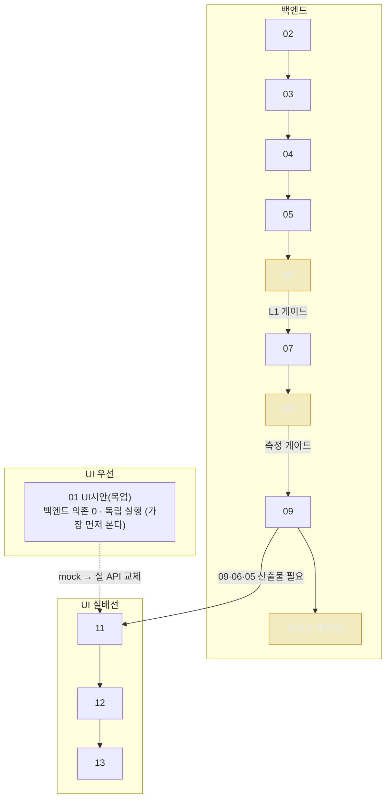

# docs-em 실행 프롬프트 — 사용법

> 정본: [00_결정 통합](../00_결정/00_결정해야할것_통합.md) · [내부 API 계약](../04_아키텍처_API/02_내부API_인터페이스.md) · [불변식 INV-1~8](../99_AI참조/01_실측제약_불변식.md) · [디자인 시스템](../06_UIUX/01_디자인시스템_참조.md)

## 0. 이게 뭔가

docs-em(100% 로컬 한국어 사내문서 RAG)을 **단계 단위로 끊어** 개발하기 위한 한방 프롬프트 묶음이다. 각 `NN_*.md`는 그 자체로 완결된 작업 지시서이며, 한 단계를 마칠 때마다 **컨텍스트를 초기화**하고 다음 단계를 새로 시작한다.

**UI 우선(최소 비용) 순서로 정렬돼 있다:**

1. **`01_UI시안_목업` — 가장 먼저.** 백엔드 없이 디자인 키트 3화면을 Vite로 띄우고 가짜 응답(mock)으로 인터랙션을 동작시켜 **UI를 바로 눈으로 확인**한다. 백엔드 의존 0.
2. **`02_환경셋업` ~ `10_리랭킹` — 백엔드(Python).** 검색·평가·답변 엔진(L1~L3) + CLI.
3. **`11_UI_API서버` ~ `13_UI_인덱싱평가` — UI 실배선.** 1번의 mock을 실제 백엔드 API로 교체.

- **왜 끊는가**: 컨텍스트 누적으로 인한 지시 희석·불변식 망각·환각을 차단한다. 단계마다 깨끗한 컨텍스트에 해당 프롬프트 전체를 다시 주입한다.
- **공통 전제**: 모든 프롬프트 상단에 확정 사실(정체·불변식 INV-1~8·확정 스택·함수 계약)이 박혀 있다. 범위 밖 발명 금지.
- **한방성**: 한 프롬프트를 붙여넣으면 그 단계의 코드·테스트·완료기준 확인까지 한 사이클에 끝난다.

## 1. 사용 절차

각 `NN_*.md`를 **번호 순서대로** 다음 사이클로 처리한다.

1. **새 컨텍스트 열기** — 직전 단계 대화를 닫고 빈 컨텍스트를 연다.
2. **파일 전체 붙여넣기** — 해당 `.md`를 통째로 붙여넣는다(상단 공통 사실 포함).
3. **완료기준 통과 확인** — 하단의 완료기준(테스트·게이트 수치)을 실제로 실행해 통과를 확인한다. 미통과 시 같은 컨텍스트에서 수정.
4. **커밋** — 통과한 산출물을 커밋한다(단계 단위 커밋).
5. **컨텍스트 초기화** → 다음 번호로.

> **UI만 먼저 보고 싶으면 `01_UI시안_목업` 하나만 실행하면 된다** — 그 단계는 백엔드를 전혀 요구하지 않는다(`npm run dev`로 3화면이 mock으로 동작).

## 2. 단계 지도

| 번호 | 제목 (파일) | 목표 | 트랙 | 게이트 |
|---|---|---|---|---|
| 01 | [UI 시안(목업) ★먼저](./01_UI시안_목업.md) | 백엔드 없이 디자인 키트 3화면을 Vite로 띄우고 mock으로 인터랙션 동작 | **UI 우선** | 외부호출0·(mock)표기 |
| 02 | [환경 셋업·스캐폴딩·실측](./02_환경셋업.md) | 디렉토리·설정·`env_check.py`로 LMStudio 실측(norm·차원·reasoning) | 백엔드 L1 | — |
| 03 | [LLM·임베딩 래퍼 ★핵심](./03_래퍼.md) | `chat()`·`embed()`로 INV-1~6을 코드 경계에 가둠 | 백엔드 L1 | — |
| 04 | [문서 로딩·한국어 청킹](./04_청킹.md) | pymupdf/python-docx 로딩, kss 문장분리, 문자 기준 청킹 | 백엔드 L1 | — |
| 05 | [벡터스토어·인덱싱(LanceDB)](./05_인덱싱.md) | VectorStore Protocol, cosine 인덱스, 사이드카 헤더 원자 교체 | 백엔드 L1 | — |
| 06 | [검색(dense)·평가·골든셋](./06_검색평가.md) | `search()` dense, `evaluate()` Recall@k·MRR·nDCG, 회귀 골든셋 | 백엔드 L1 | ✅ L1 게이트 |
| 07 | [BM25·RRF 하이브리드](./07_하이브리드.md) | rank_bm25 + Kiwi, RRF(k=60), dense 대비 기여도 측정 | 백엔드 L2 | — |
| 08 | [BGE-M3 임베딩 교체 실험](./08_임베딩교체.md) | 768→1024 재인덱싱, 단독변수 Recall@1 개선 측정으로 채택/롤백 | 백엔드 L2 | ✅ 측정 게이트 |
| 09 | [답변 생성·출처 인용·CLI](./09_답변생성.md) | `answer()` {text, citations}, 출처 인용, CLI 진입점 | 백엔드 L2 | — |
| 10 | [리랭킹(L3)·서빙 검증](./10_리랭킹.md) | BGE-reranker-v2-m3 서빙 실측 후 `rerank()`, 기여도 측정 | 백엔드 L3 | ✅ L3 게이트 |
| 11 | [UI 실배선: API 서버·AppShell](./11_UI_API서버.md) | FastAPI로 answer/search/eval/인덱싱 HTTP 노출 + AppShell 헬스 배선 | UI 실배선 | — |
| 12 | [UI 실배선: 화면 A 질의응답](./12_UI_질의응답.md) | QueryScreen을 실제 검색·답변 API에 배선(인용⊆Top-k, 상태) | UI 실배선 | — |
| 13 | [UI 실배선: 화면 B 인덱싱 + C 평가](./13_UI_인덱싱평가.md) | IndexScreen·EvalScreen 실배선(파이프라인 / Recall@1 KPI·골든셋) | UI 실배선 | ✅ 데모배지 게이트 |

## 3. 단계 간 의존성



- **01 (UI 시안)**: 어디에도 의존하지 않음. 디자인 키트(`디자인/docs-em Design System/`)만 있으면 됨. mock 모듈을 실 API와 같은 시그니처로 작성해 두면 13단계에서 교체만 하면 된다.
- **02**: 백엔드 모든 단계의 선행. Phase 0 실측 수치가 03·05·08의 가드/계약 근거.
- **03**: 04·05·06·08·09·10이 `chat()`/`embed()` 래퍼에 의존. 불변식 경계가 여기서 확정.
- **04 → 05**: 청킹 산출(`Chunk`)이 인덱싱 입력. **05 → 06**: 인덱스·헤더가 `search()`/`evaluate()` 대상.
- **06 → 07 → 08**: dense baseline이 하이브리드·임베딩 교체 측정의 기준선. 변수 1개씩(INV-7).
- **09 → 10**: 답변 생성 위에 리랭커. 10은 진입 전 서빙 실측 선행.
- **11 (UI 실배선 시작)**: `answer()`(09)·`evaluate()`(06)·인덱싱(05)을 FastAPI로 노출 + 01의 web/를 재사용. **백엔드 미완 시 중단.**
- **11 → 12 → 13**: 01에서 만든 mock UI를 실 API에 배선. 변수 1개씩·BGE-M3 화면B 한정·`+rrf` 회귀성공은 데모 배지 규칙 강제.

## 4. 게이트

게이트는 정량 수치/정적 점검으로 통과 판정한다. 미통과 시 해당 단계에서 **진행 금지**.

- **외부 호출 0건 게이트 (01 / 11~13) — 폐쇄망**: UI 빌드 산출물에 외부 URL(unpkg·jsdelivr·googleapis·gstatic·CDN) **0건**, 프론트가 `localhost:1234`(LMStudio)를 직접 호출 안 함(우리 백엔드만, 01은 mock뿐). 폰트·React·번들 전부 로컬 vendoring(INV-3). `EXTERNAL CALLS: 0` 고정.
- **(mock) 표기 게이트 (01)**: 모든 데이터가 가짜이므로 화면이 스스로 `(mock)`임을 표기. `+rrf` 성공·안정성 게이지엔 `(데모)` 배지.
- **L1 게이트 (06) — 회귀 재현**: 회귀 케이스("연차 휴가 신청 절차" → 휴가규정)가 골든셋에 포함되고, dense-only에서 이 케이스 **Recall@1=0**을 재현. 0이 정상(아직 못 맞히는 상태를 측정으로 고정).
- **측정 게이트 (08) — BGE-M3 채택**: BGE-M3를 **단독 변수**로 교체해 골든셋 Recall@1이 nomic 대비 **개선**되어야 채택. 미개선 시 nomic 롤백. 회귀 0→1 전환이 1차 성패 척도.
- **L3 게이트 (10) — 리랭커**: BGE-reranker-v2-m3 **로컬 서빙 실측**을 진입 전 선행. 리랭킹이 top_n 품질에 기여(Recall/MRR 비퇴행)함을 측정으로 증명.
- **데모 배지 게이트 (13) — 발명 금지**: `+rrf`만으로 회귀 Recall@1 0→1 전환은 **SSOT상 실측 근거가 없다**(교정 레버는 L2 BGE-M3·L3 리랭커, 둘 다 evaluate가 수행 안 함). 화면 C의 `+rrf` 성공 시각화·안정성 게이지 데모값은 **모두 `(데모)` 배지**, 실 `evaluate` 결과만 실값. (`+bm25`와 `+rrf`는 백엔드상 같은 `use_bm25=True` 호출이라 같은 실값을 내는 게 정상.)

> 공통 INV-7: 정량 증명은 Recall@k(1/3/5/10)·MRR·nDCG@10. 변수는 한 번에 하나만.

## 5. 절대 규칙 요약 (불변식 INV-1~8)

- **외부 API 금지(INV-3)**: 모든 추론/임베딩/생성은 로컬 LMStudio(`http://localhost:1234/v1`)만. 외부 클라우드 호출 0건.
- **INV-1**: 임베딩 재정규화 금지(nomic norm=1.0). 가드 `abs(norm-1.0)<1e-3`. 모델 교체 시 norm 재측정.
- **INV-2**: `content` 빈값 → `reasoning_content` 폴백. 우회책(`/no_think`·`enable_thinking=false`·`reasoning_effort=low`·`max_tokens=4000`) 전부 무효.
- **INV-4**: `prompt_tokens=0` 불신. 길이 판단은 문자 수/로컬 토크나이저 가드로(fail-closed).
- **INV-5**: `<think>…</think>` 정제. 구분자 불일치 시 원문+[경고](무음 빈답 금지).
- **INV-6**: `finish_reason=length`면 max_tokens×3로 1회 재시도, 2회째도 length면 경고 부착.
- **INV-7**: 정량 증명. 회귀 케이스 합격선 Recall@1=1. 변수 1개씩만 변경.
- **INV-8**: prefix 효과 미미(nomic 0.687→0.695). e5 계열 교체 시 `query:`/`passage:` prefix 필수.

---

## 6. 이 PC 실행 환경 (실측 2026-06-17, macOS arm64)

이 묶음은 **이 PC에서 실행**하는 것을 기준으로 환경을 실측·보정했습니다.

| 항목 | 실측 | 상태 |
|---|---|---|
| OS / 아키텍처 | macOS (darwin 25.5.0), arm64 (Apple Silicon) | ✅ |
| Node / npm (UI: 01·11~13) | **v24.11.1 / 11.10.1** (pnpm·bun도 있음) | ✅ |
| 기본 `python3` | **3.14.5** — 무심코 쓰면 네이티브 휠 미존재 | ⚠️ `--python 3.11` 명시 필수 |
| Python 3.11 (백엔드) | uv로 3.11.13 설치됨 | ✅ |
| uv | 0.8.4 | ✅ |
| LMStudio | `http://localhost:1234/v1` 가동 | ✅ |
| 생성 모델 id | `google/gemma-4-e4b`, `qwen/qwen3.5-9b`, `qwen/qwen3.6-35b-a3b` 등 — **prefix 포함** | ✅ |
| 임베딩 모델 | `text-embedding-nomic-embed-text-v1.5` 로드됨 | ✅ |
| BGE-M3 / BGE-reranker | **미로드** — 단계 08/10 진입 전 LMStudio에서 로드 | ⏳ |
| 핵심 패키지 | kss 4.x(상한 고정), kiwipiepy 0.23.2, lancedb 0.33.0 등 — arm64 휠 존재 | ✅ |

### UI만 먼저 보기 — 01 시작 전 (Node만 있으면 됨)

```bash
node -v && npm -v          # v24.x / 11.x 기대. 백엔드·Python·LMStudio 불필요
# → 01_UI시안_목업.md를 에이전트에 붙여넣어 web/ 생성 후: cd web && npm run dev
```

### 백엔드(02~) 시작 전 체크리스트 (1회)

```bash
uv --version                                  # 0.8.4 기대
uv python list | grep 3.11                     # 3.11.x 존재 확인 (기본 python3=3.14 사용 금지)
curl -s http://localhost:1234/v1/models | python3 -c "import sys,json; [print(m['id']) for m in json.load(sys.stdin)['data']]"
# 단계 08 진입 전에만: curl -s http://localhost:1234/v1/models | grep -i bge || echo "BGE 미로드"
```

### 이 PC 기준 보정 사항 (이미 프롬프트에 반영됨)

- **모델 id prefix**: `qwen/qwen3.5-9b` 등 — LMStudio 실측 id 그대로(prefix 없으면 `chat()` 404).
- **kss 버전 상한**: `kss>=4.5,<5` — 최신 6.x는 mecab/pecab 백엔드가 arm64 비호환. 설치 실패 시 정규식 폴백.
- **Python 3.11 고정**: 모든 `uv venv`는 `--python 3.11`. 기본 3.14로 만들면 lancedb/kiwipiepy 휠 미존재.
- **lancedb 핀**: `>=0.33,<0.34`(실측 0.33.0). `_distance` 반환범위는 설치 후 버전 확인하고 주석.
- **UI 폰트 vendoring**: Pretendard·JetBrains Mono `.woff2`를 로컬로(폐쇄망). 정본 `fonts.css`는 CDN을 가리키므로 빌드타임에 로컬 재지정.

> 참고: macOS `grep`은 BSD 계열이지만 `-rnE`·`-rniE`·`\b`를 모두 지원하므로 검증 명령은 그대로 동작합니다(실측 확인됨).
